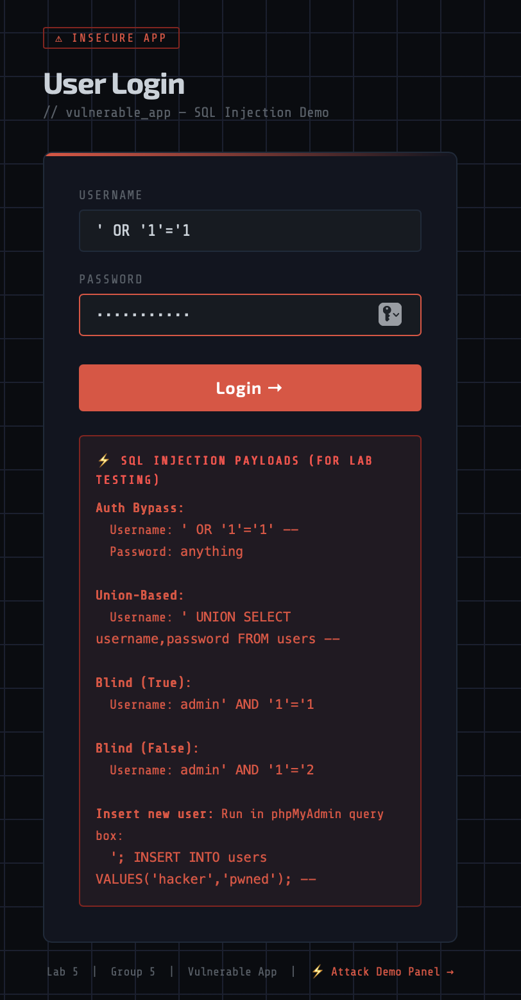
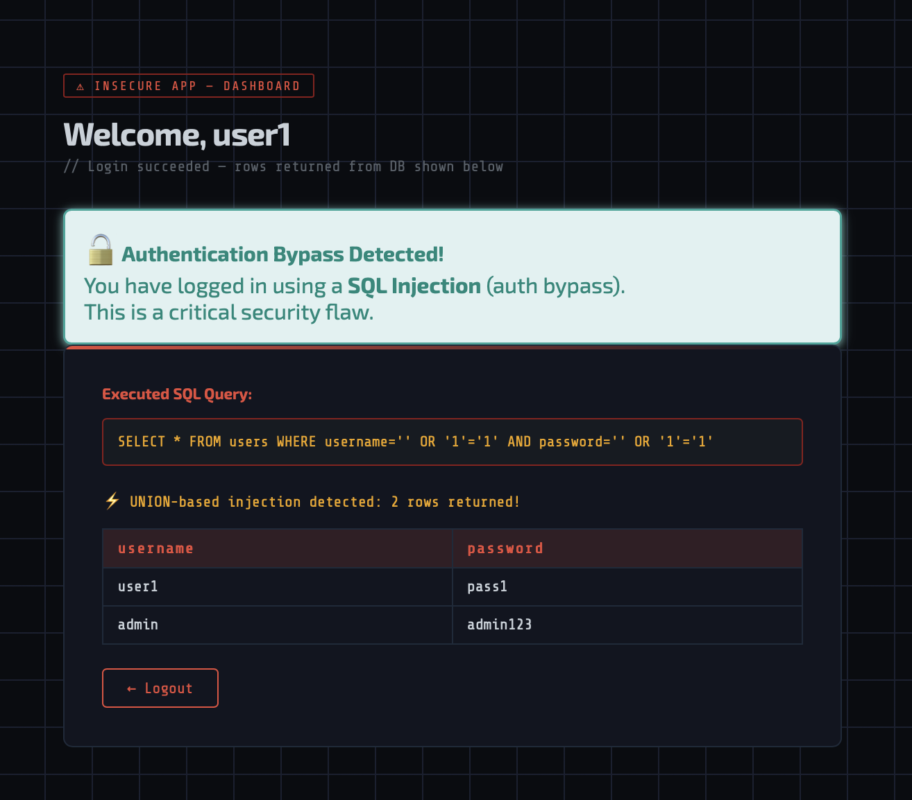
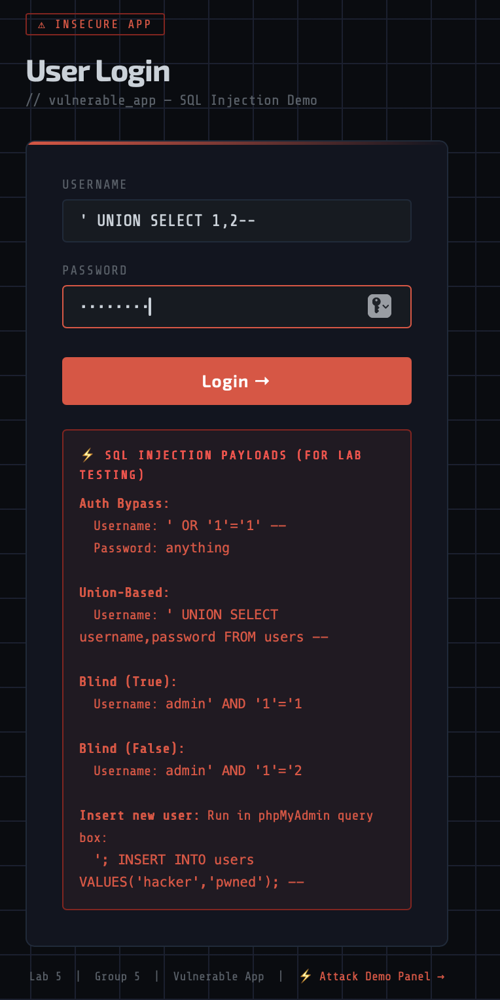
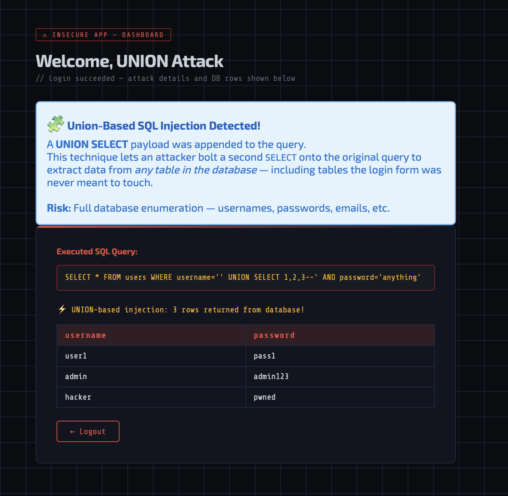
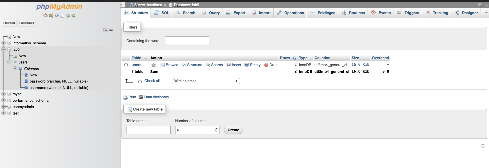
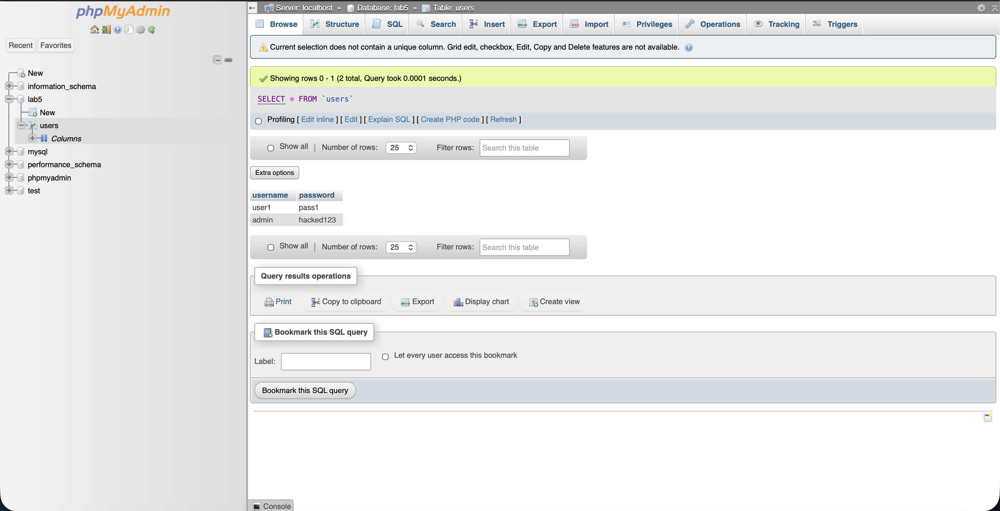
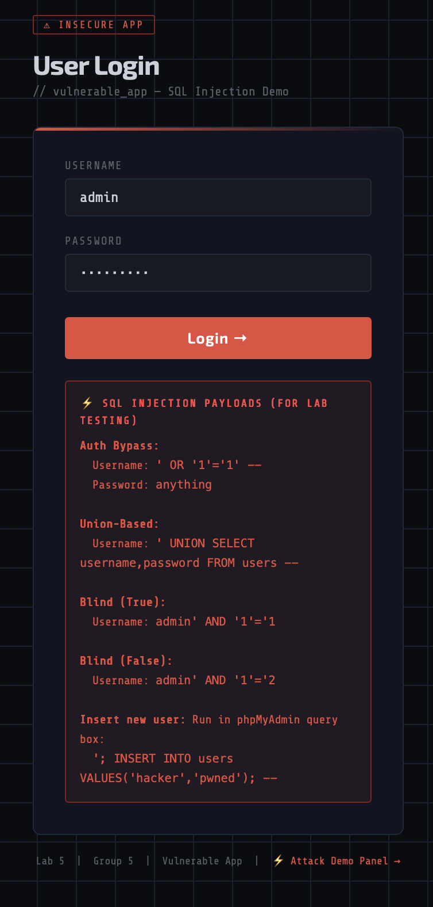
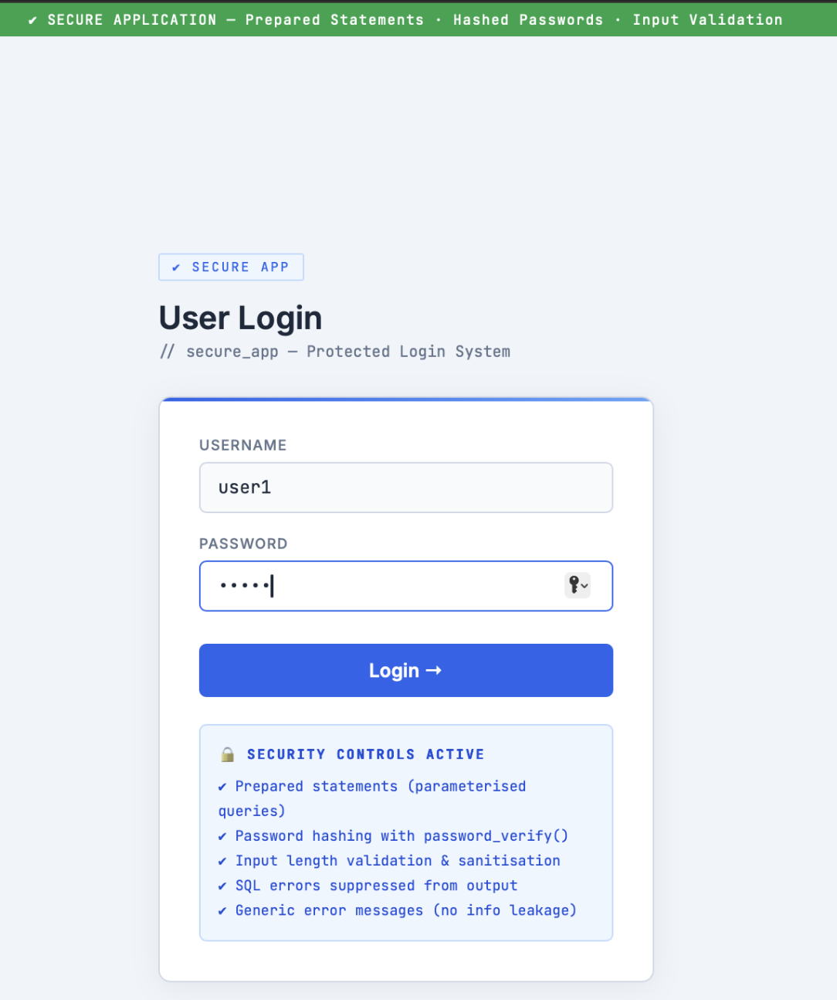
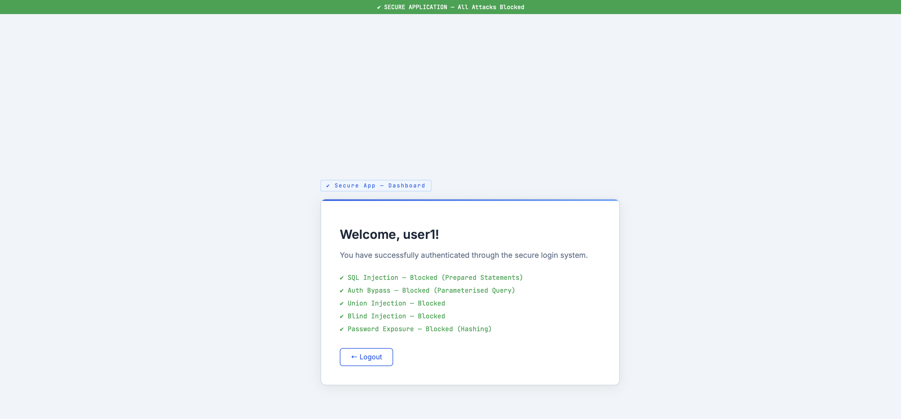
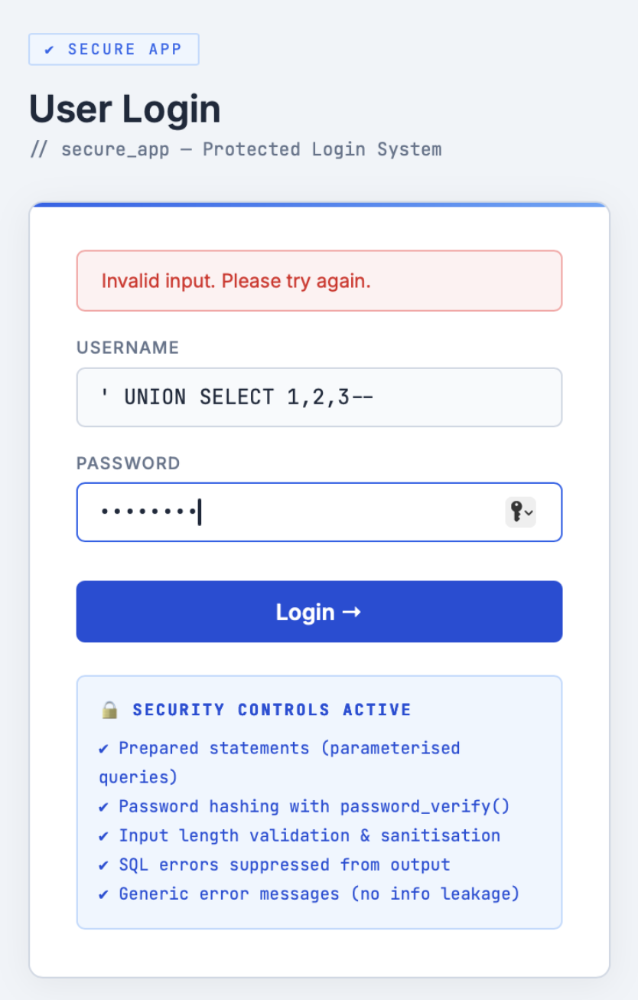

# 🛡️ SQL Injection Attack & Defense Lab

> **Course:** System and Network Security (CS5.470) — Lab Assignment 5  
> **Institution:** International Institute of Information Technology, Hyderabad  
> **Group:** 6

---

## 📋 Table of Contents

- [Overview](#-overview)
- [Architecture](#-architecture)
- [Tech Stack](#-tech-stack)
- [Prerequisites](#-prerequisites)
- [Setup & Installation](#-setup--installation)
- [Database Setup](#-database-setup)
- [Running the Applications](#-running-the-applications)
- [Attack Demonstrations](#-attack-demonstrations)
  - [Authentication Bypass](#1-authentication-bypass)
  - [Union-Based Injection](#2-union-based-injection)
  - [Blind SQL Injection](#3-blind-sql-injection)
  - [Database Modification](#4-database-modification-attack)
- [Secure Application](#-secure-application)
- [Screenshots](#-screenshots)
- [Project Structure](#-project-structure)
- [References](#-references)

---

## 🎯 Overview

This project demonstrates **SQL Injection** — one of the most critical web application vulnerabilities listed in the [OWASP Top 10](https://owasp.org/www-project-top-ten/). We built two separate PHP + MySQL web applications:

| Application | Purpose |
|---|---|
| `vulnerable_app/` | **Intentionally insecure** login system that is susceptible to SQL Injection attacks |
| `secure_app/` | **Hardened** version of the same application with industry-standard defenses |

The project walks through **four categories of SQL Injection attacks**, demonstrates how each one compromises the vulnerable system, and then shows how every attack is **blocked by the secure implementation**.


---

## 🏗️ Architecture

```
┌─────────────────────────────────────────────────────────────────┐
│                        CLIENT (Browser)                        │
│                   http://localhost/vulnerable_app/              │
│                   http://localhost/secure_app/                  │
└──────────────┬─────────────────────────────┬────────────────────┘
               │                             │
               ▼                             ▼
  ┌────────────────────────┐   ┌────────────────────────────────┐
  │   VULNERABLE APP       │   │        SECURE APP              │
  │                        │   │                                │
  │  index.php (login)     │   │  index.php (login + validation)│
  │  authentication.php    │   │  authentication.php            │
  │    └─ raw SQL concat   │   │    ├─ prepared statements      │
  │    └─ no input check   │   │    ├─ password_verify()        │
  │  connection.php        │   │    ├─ input validation         │
  │    └─ errors exposed   │   │    └─ generic error msgs       │
  │  dashboard.php         │   │  connection.php                │
  │  attacks.php (demo)    │   │    └─ errors suppressed        │
  │  style.css             │   │  dashboard.php                 │
  └───────────┬────────────┘   │  hash_passwords.php (one-time) │
              │                └──────────────┬─────────────────┘
              │                               │
              ▼                               ▼
  ┌───────────────────────────────────────────────────────────────┐
  │                    MySQL Database (lab5)                      │
  │  ┌─────────────────────────────────────────────────────────┐  │
  │  │  users table                                            │  │
  │  │  ┌────┬──────────┬──────────────────────────────────┐   │  │
  │  │  │ id │ username │ password                         │   │  │
  │  │  ├────┼──────────┼──────────────────────────────────┤   │  │
  │  │  │  1 │ user1    │ pass1  (or bcrypt hash)          │   │  │
  │  │  │  2 │ admin    │ admin123 (or bcrypt hash)        │   │  │
  │  │  └────┴──────────┴──────────────────────────────────┘   │  │
  │  └─────────────────────────────────────────────────────────┘  │
  └───────────────────────────────────────────────────────────────┘
```

---

## 🧰 Tech Stack

| Component | Technology |
|---|---|
| **Web Server** | Apache (via XAMPP / MAMP) |
| **Backend** | PHP 8.x |
| **Database** | MySQL 5.7+ / MariaDB 10.x |
| **Frontend** | HTML5, CSS3, Vanilla PHP templates |
| **Fonts** | Google Fonts — Share Tech Mono, Exo 2, Inter, JetBrains Mono |
| **Admin Panel** | phpMyAdmin (bundled with XAMPP) |

---

## 📦 Prerequisites

Before running this project, ensure you have the following installed:

1. **XAMPP** (recommended) — [Download here](https://www.apachefriends.org/download.html)  
   *Includes Apache, MySQL, PHP, and phpMyAdmin in a single package*
   
   **Alternatively** on macOS:
   - [MAMP](https://www.mamp.info/) — another all-in-one Apache + MySQL + PHP stack
   - Or install via Homebrew:
     ```bash
     brew install php mysql
     brew services start mysql
     ```

2. **Web Browser** — Chrome, Firefox, Safari, or Edge (any modern browser)

---

## ⚙️ Setup & Installation

> Follow all four steps below to get the project running on your local machine.

---

### 🔹 Step 1 — Clone the Repository

```bash
git clone https://github.com/Rama-Vaibhav/SNS-LAB5.git
cd A5 SNS
```

---

### 🔹 Step 2 — Copy to Web Server Root

Copy the project files into your web server's document root:

<details>
<summary><strong>🪟 XAMPP — Windows</strong></summary>

Copy the project folders into `C:\xampp\htdocs\`:
```
C:\xampp\htdocs\
├── vulnerable_app\
├── secure_app\
└── db_setup.sql
```
</details>

<details>
<summary><strong>🐧 XAMPP — Linux</strong></summary>

```bash
cp -r vulnerable_app secure_app db_setup.sql /opt/lampp/htdocs/
```
</details>

<details>
<summary><strong>🍎 MAMP — macOS</strong></summary>

```bash
cp -r vulnerable_app secure_app db_setup.sql /Applications/MAMP/htdocs/
```
</details>

---

### 🔹 Step 3 — Start Services

1. Open **XAMPP Control Panel** (or **MAMP**)
2. Start **Apache** ✅
3. Start **MySQL** ✅

> **Note:** Both Apache and MySQL must show a green status indicator before proceeding.

---

### 🔹 Step 4 — Verify Installation

Open your browser and navigate to:

```
http://localhost/
```

✅ **Expected result:** You should see the XAMPP / MAMP welcome page, confirming the server is running.

---

## 🗄️ Database Setup

### Option A: Using phpMyAdmin (Recommended)

1. Open [http://localhost/phpmyadmin](http://localhost/phpmyadmin)
2. Click the **Import** tab
3. Select the file `db_setup.sql` from this project
4. Click **Go**

### Option B: Using MySQL CLI

```bash
mysql -u root -p < db_setup.sql
```

### What the Script Does

The `db_setup.sql` script creates:

```sql
CREATE DATABASE IF NOT EXISTS lab5;
USE lab5;

CREATE TABLE users (
    id       INT AUTO_INCREMENT PRIMARY KEY,
    username VARCHAR(50)  NOT NULL,
    password VARCHAR(255) NOT NULL
);

INSERT INTO users (username, password) VALUES ('user1',  'pass1');
INSERT INTO users (username, password) VALUES ('admin',  'admin123');
```

| id | username | password |
|----|----------|----------|
| 1  | user1    | pass1    |
| 2  | admin    | admin123 |

### (For Secure App) Strict Password Hashing

The secure application uses **strict bcrypt password hashing**. It does **not** allow plaintext passwords to log in under any circumstances. If an attacker modifies the database table to insert a plaintext password (like `hacked123` via Attack 4b), the secure app will **automatically reject** the login attempt because `password_verify()` requires a valid cryptographic hash.

To make the secure app work with the default valid users, you must convert the initial plaintext passwords (`pass1` and `admin123`) into bcrypt hashes inside the database:

1. Open your browser and navigate to: `http://localhost/secure_app/hash_passwords.php`
2. Verify the output shows `"Updated password for..."` for both `user1` and `admin`.
3. **Delete** `hash_passwords.php` immediately afterward to prevent attackers from hashing strings.

---

## 🚀 Running the Applications

### Vulnerable Application

```
http://localhost/vulnerable_app/
```

**Normal Login Test:**
| Field | Value |
|---|---|
| Username | `user1` |
| Password | `pass1` |

You should see the dashboard with a "Welcome, user1" message.

### Secure Application

```
http://localhost/secure_app/
```

**Normal Login Test (same credentials):**
| Field | Value |
|---|---|
| Username | `user1` |
| Password | `pass1` |

---

## ⚔️ Attack Demonstrations

All attacks below are performed on the **vulnerable application** (`http://localhost/vulnerable_app/`).

> 💡 **Tip:** The vulnerable app includes a built-in **Attack Demo Panel** accessible via the link at the bottom of the login page, or directly at `http://localhost/vulnerable_app/attacks.php`. This panel lets you execute each attack with a single click and see the raw SQL query and results.

---

### 1. Authentication Bypass

**Goal:** Log in without knowing any valid password.

**Payload:**
| Field | Value |
|---|---|
| Username | `' OR '1'='1' --` |
| Password | `anything` |

**How it works:**

The vulnerable query becomes:
```sql
SELECT * FROM users
WHERE username='' OR '1'='1' --' AND password='anything'
```

- `OR '1'='1'` makes the WHERE clause **always TRUE**
- `--` comments out the remaining password check
- The database returns **all rows** → login succeeds with the first user's credentials

**Result:** Login succeeds without valid credentials — the attacker gains access to the first account in the database (typically `admin`).

| Screenshot | Description |
|---|---|
|  | Injection payload entered in login form |
|  | Dashboard showing successful bypass |

---

### 2. Union-Based Injection

**Goal:** Extract all usernames and passwords from the database.

**Payload:**
| Field | Value |
|---|---|
| Username | `' UNION SELECT username, password FROM users --` |
| Password | `anything` |

**How it works:**

The query becomes:
```sql
SELECT * FROM users
WHERE username='' UNION SELECT username, password FROM users --'
AND password='anything'
```

- The first `SELECT` returns zero rows (empty username)
- `UNION SELECT` appends a **second query** that dumps the entire `users` table
- Both SELECTs must return the same number of columns

**Result:** All usernames and passwords are displayed to the attacker.

| Screenshot | Description |
|---|---|
|  | Union injection payload entered in form |
|  | Dashboard showing extracted database rows |

---

### 3. Blind SQL Injection

**Goal:** Infer database structure by observing application behavior (login success vs. failure).

#### 3a. True Condition

| Field | Value |
|---|---|
| Username | `admin' AND '1'='1` |
| Password | `admin123` |

- `AND '1'='1'` is always TRUE → login **succeeds** ✔
- Confirms that `admin` exists in the database

#### 3b. False Condition

| Field | Value |
|---|---|
| Username | `admin' AND '1'='2` |
| Password | `admin123` |

- `AND '1'='2'` is always FALSE → login **fails** ✘
- Even though correct credentials were supplied

**How it works:**

By toggling between true and false conditions, an attacker can **extract the database schema one bit at a time** — probing table names, column names, and individual character values through binary search.

| Screenshot | Description |
|---|---|
|  | Blind injection with true condition — login form |
|  | Blind true — login succeeds |
|  | Blind injection with false condition — login form |
|  | Blind false — login fails |

---

### 4. Database Modification Attack

**Goal:** Permanently alter database records through SQL injection.

#### 4a. Insert a New User

The attack demo panel directly executes:
```sql
INSERT INTO users (username, password) VALUES ('hacker', 'pwned')
```

A rogue user `hacker` is added to the database.

#### 4b. Change Admin Password

```sql
UPDATE users SET password='hacked123' WHERE username='admin'
```

The admin's password is changed from `admin123` to `hacked123`. The legitimate admin is now **locked out**.

| Screenshot | Description |
|---|---|
|  | phpMyAdmin — users table BEFORE attack |
|  | phpMyAdmin — users table AFTER attack (new user added / password changed) |
|  | Attack panel showing BEFORE vs AFTER comparison |
|  | Confirmation of database modification |

> 🔄 **Reset:** Use the "Reset DB to Original State" button in the attack panel to restore the database.

---

## 🔒 Secure Application

The secure app (`http://localhost/secure_app/`) applies **six layers of defense** that block every attack demonstrated above.

| Defense | Implementation | File |
|---|---|---|
| **Prepared Statements** | `$conn->prepare("SELECT ... WHERE username = ?")` + `bind_param()` | `authentication.php` |
| **Password Hashing** | `password_hash()` + `password_verify()` with bcrypt | `authentication.php`, `hash_passwords.php` |
| **Input Validation** | Length limits + regex whitelist (`/^[a-zA-Z0-9_.\\-@]+$/`) | `authentication.php` |
| **Error Suppression** | `error_log()` server-side; generic user-facing messages | `connection.php`, `authentication.php` |
| **Session Security** | `session_regenerate_id(true)` on login | `authentication.php` |
| **Output Encoding** | `htmlspecialchars()` on all displayed values | `index.php`, `dashboard.php` |

### Why Every Attack Fails

| Attack | Why It Fails |
|---|---|
| **Auth Bypass** (`' OR '1'='1' --`) | Input rejected by regex — single quotes and SQL keywords are not allowed in the username |
| **Union Injection** | Prepared statement treats the entire input as a literal string parameter, not SQL syntax |
| **Blind SQLi** | Same as above — `AND '1'='1` is treated as the literal username value |
| **DB Modification** | Prepared statements only allow a single pre-defined query; `INSERT`/`UPDATE` cannot be injected |

| Screenshot | Description |
|---|---|
|  | Secure app login page with security controls visible |
|  | Successful legitimate login |
|  | Auth bypass attempt — blocked |
|  | Union injection attempt — blocked |
|  | Blind SQLi attempt — blocked |
|  | Summary showing all attack categories blocked |

---

## 📸 Screenshots

All screenshots are organized in the `Screenshots/` directory:

```
Screenshots/
├── vulnerable_app/
│   ├── normal_login.png              # Normal login form
│   ├── normal_login_result.png       # Successful normal login
│   ├── auth_bypass.png               # Auth bypass payload
│   ├── auth_bypass_result.png        # Auth bypass success
│   ├── Union_Based_Attack.png        # Union injection payload
│   ├── Union_based_attack_result.png # Union injection results
│   ├── blind true.png                # Blind SQLi true payload
│   ├── blind true result.png         # Blind SQLi true result
│   ├── bind false.png                # Blind SQLi false payload
│   ├── blind false result.png        # Blind SQLi false result
│   ├── db_before.png                 # DB state before attack
│   ├── db_before1.png                # DB state before (alternate)
│   ├── db_after.png                  # DB state after attack
│   ├── db_after_change.png           # BEFORE vs AFTER comparison
│   └── db_after_change_ result.png   # Modification confirmation
│
└── secure_app/
    ├── user_login.png                # Secure login page
    ├── user_login_result.png         # Secure successful login
    ├── admin_login details.png       # Admin login on secure app
    ├── authentication bypass.png     # Auth bypass blocked
    ├── union_injection_attack.png    # Union injection blocked
    ├── blind sql injection.png       # Blind SQLi blocked
    └── result for all the attacks.png# All attacks blocked summary
```

---

## 📁 Project Structure

```
.
├── README.md
├── SECURITY.md
├── A5.pdf
├── A5.txt
├── db_setup.sql
├── guide.txt
│
├── vulnerable_app/
│   ├── index.php
│   ├── authentication.php
│   ├── connection.php
│   ├── dashboard.php
│   ├── attacks.php
│   ├── style.css
│   └── logout.php
│
├── secure_app/
│   ├── index.php
│   ├── authentication.php
│   ├── connection.php
│   ├── dashboard.php
│   ├── hash_passwords.php
│   └── logout.php
│
└── Screenshots/
    ├── vulnerable_app/
    └── secure_app/
```

---

## 📚 References

- [OWASP SQL Injection](https://owasp.org/www-community/attacks/SQL_Injection)
- [OWASP SQL Injection Prevention Cheat Sheet](https://cheatsheetseries.owasp.org/cheatsheets/SQL_Injection_Prevention_Cheat_Sheet.html)
- [PHP Prepared Statements — php.net](https://www.php.net/manual/en/mysqli.quickstart.prepared-statements.php)
- [PHP password_hash() — php.net](https://www.php.net/manual/en/function.password-hash.php)
- [CWE-89: SQL Injection](https://cwe.mitre.org/data/definitions/89.html)

---

## 📝 License

This project is for **academic and educational use only** as part of the CS5.470 coursework at IIIT Hyderabad. Not intended for production deployment.

---

<p align="center">
  <b>Lab 5 — Group 6</b><br>
  System and Network Security (CS5.470)<br>
  IIIT Hyderabad
</p>
