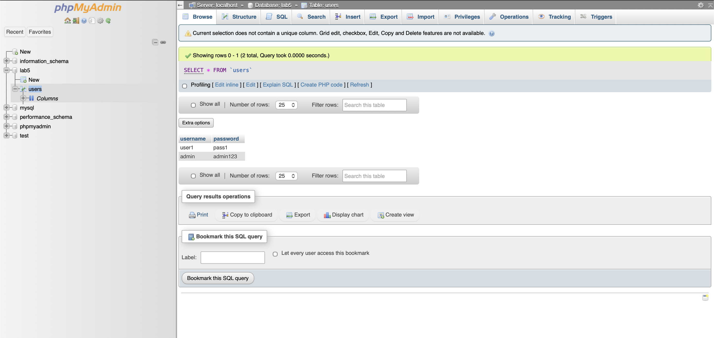
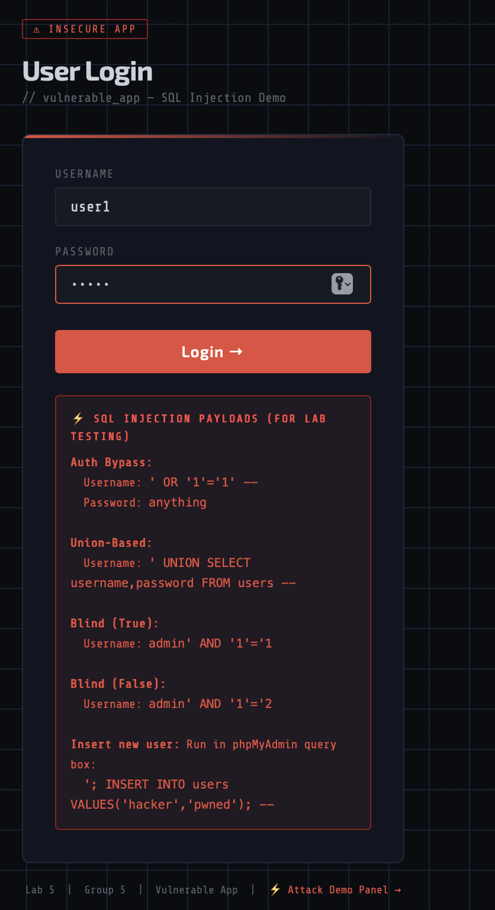
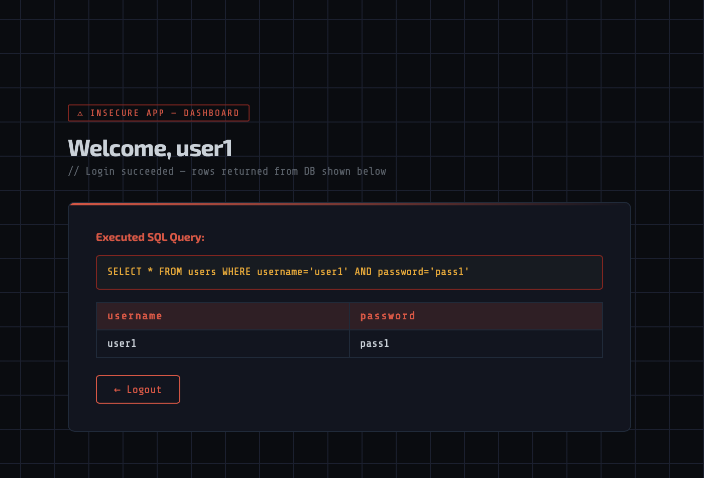

# 🔐 SECURITY.md — SQL Injection Analysis & Defense Report

> **Lab 5 | Group 5** — System and Network Security (CS5.470)  
> IIIT Hyderabad

---

## Table of Contents

- [1. What Is SQL Injection?](#1-what-is-sql-injection)
- [2. Why Is It Dangerous?](#2-why-is-it-dangerous)
- [3. The Vulnerable Application](#3-the-vulnerable-application)
- [4. Attacks Performed](#4-attacks-performed)
  - [4.1 Authentication Bypass](#41-authentication-bypass)
  - [4.2 Union-Based Injection](#42-union-based-injection)
  - [4.3 Blind SQL Injection](#43-blind-sql-injection)
  - [4.4 Database Modification Attack](#44-database-modification-attack)
- [5. How Attacks Modified the Database](#5-how-attacks-modified-the-database)
- [6. The Secure Application — Defense Mechanisms](#6-the-secure-application--defense-mechanisms)
  - [6.1 Prepared Statements (Parameterized Queries)](#61-prepared-statements-parameterized-queries)
  - [6.2 Password Hashing](#62-password-hashing)
  - [6.3 Input Validation & Sanitization](#63-input-validation--sanitization)
  - [6.4 Error Suppression (No Information Leakage)](#64-error-suppression-no-information-leakage)
  - [6.5 Session Security](#65-session-security)
  - [6.6 Output Encoding](#66-output-encoding)
- [7. Attack vs. Defense Matrix](#7-attack-vs-defense-matrix)
- [8. Screenshots — Visual Evidence](#8-screenshots--visual-evidence)
- [9. Lessons Learned](#9-lessons-learned)

---

## 1. What Is SQL Injection?

**SQL Injection (SQLi)** is a code injection technique that exploits vulnerabilities in web applications that construct SQL queries using unsanitized user input. When user-supplied data is directly concatenated into a SQL query string without proper escaping or parameterization, an attacker can manipulate the query's logic to:

- Bypass authentication
- Read sensitive data from the database
- Modify or delete data
- Execute administrative operations on the database

SQL Injection is ranked **#3 on the OWASP Top 10 (2021)** under "A03:2021 — Injection" and has been a persistent threat since the early days of web development.

### How It Works — The Core Problem

A typical vulnerable login query looks like this:

```php
$sql = "SELECT * FROM users WHERE username='$username' AND password='$password'";
```

Here, `$username` and `$password` are taken directly from user input (`$_POST`). The application **trusts** the user to provide a normal username like `admin`. But an attacker can supply:

```
Username: ' OR '1'='1' --
Password: anything
```

This transforms the query into:

```sql
SELECT * FROM users WHERE username='' OR '1'='1' --' AND password='anything'
```

- `OR '1'='1'` is always TRUE ➜ returns all rows
- `--` is the SQL comment operator ➜ everything after it is ignored
- **Result:** The attacker bypasses authentication entirely

---

## 2. Why Is It Dangerous?

| Impact | Severity |
|---|---|
| **Unauthorized Access** | An attacker can log in as any user, including administrators |
| **Data Theft** | Entire database tables can be dumped — usernames, passwords, credit cards, PII |
| **Data Manipulation** | Attackers can INSERT, UPDATE, or DELETE records — defacing data or creating backdoors |
| **Data Destruction** | `DROP TABLE` or `DROP DATABASE` can permanently destroy data |
| **Privilege Escalation** | In some DBMS configurations, SQLi can lead to OS-level command execution |
| **Compliance Violations** | GDPR, HIPAA, PCI-DSS breaches resulting from data leaks |

### Real-World Examples

- **Heartland Payment Systems (2008):** 130 million credit card numbers stolen via SQLi
- **Sony Pictures (2011):** Over 1 million user accounts compromised
- **LinkedIn (2012):** 6.5 million password hashes leaked
- **TalkTalk (2015):** 157,000 customer records stolen, £400K fine

---

## 3. The Vulnerable Application

Our vulnerable application (`vulnerable_app/`) was built with **intentional security flaws** to demonstrate SQL Injection in a controlled lab environment.

### Vulnerable Code — `authentication.php`

```php
// ❌ VULNERABLE: User input directly concatenated into SQL
$username = $_POST['username'];
$password = $_POST['password'];

$sql = "SELECT * FROM users WHERE username='$username' AND password='$password'";
$result = mysqli_query($conn, $sql);
```

### Why This Is Insecure

| Flaw | Description |
|---|---|
| **No input validation** | Any characters (quotes, dashes, semicolons) are accepted without filtering |
| **String concatenation** | User input becomes part of the SQL syntax — not just data |
| **No parameterization** | The database engine cannot distinguish between SQL code and user data |
| **Plaintext passwords** | Passwords stored as-is — any data leak exposes them immediately |
| **Error messages displayed** | `die("Connection failed: " . mysqli_connect_error())` reveals server internals |

### Vulnerable Connection — `connection.php`

```php
// ❌ Error message exposes database details to attacker
$conn = mysqli_connect($host, $dbuser, $dbpass, $dbname);
if (!$conn) {
    die("Connection failed: " . mysqli_connect_error());
}
```

---

## 4. Attacks Performed

### 4.1 Authentication Bypass

| Property | Details |
|---|---|
| **Type** | Tautology-based SQL Injection |
| **CWE** | [CWE-89](https://cwe.mitre.org/data/definitions/89.html) |
| **Target** | Login form — username field |
| **Payload** | `' OR '1'='1' --` |
| **Password** | `anything` (irrelevant) |

#### Injected Query

```sql
SELECT * FROM users
WHERE username='' OR '1'='1' --' AND password='anything'
                 ^^^^^^^^^^^^^^^^ ^^
                 always TRUE      rest is commented out
```

#### What Happens

1. The `WHERE` condition becomes: `username='' OR TRUE`
2. `OR TRUE` means the entire condition evaluates to **TRUE** for every row
3. `--` comments out the password check entirely  
4. All rows are returned → first row is used for login
5. **Attacker is logged in as the first user in the table** (typically `user1` or `admin`)

#### Evidence

| Screenshot | What It Shows |
|---|---|
|  | The injection payload typed into the login form |
|  | Dashboard confirming successful bypass — logged in without valid credentials |

---

### 4.2 Union-Based Injection

| Property | Details |
|---|---|
| **Type** | Union-based SQL Injection |
| **CWE** | [CWE-89](https://cwe.mitre.org/data/definitions/89.html) |
| **Target** | Login form — username field |
| **Payload** | `' UNION SELECT username, password FROM users --` |
| **Password** | `anything` (irrelevant) |

#### Injected Query

```sql
SELECT * FROM users
WHERE username='' UNION SELECT username, password FROM users --'
AND password='anything'
```

#### What Happens

1. The first `SELECT` returns 0 rows (no user with an empty username)
2. `UNION SELECT` appends a **second query** to the result set
3. The second query dumps **all usernames and passwords** from the `users` table
4. Both `SELECT` statements must return the **same number of columns** — the attacker must determine the column count first (e.g., by testing `UNION SELECT 1,2`, `UNION SELECT 1,2,3`, etc.)
5. **All database credentials are exposed**

#### Risk

This attack enables **full database enumeration**. An attacker can:
- Extract every table name: `UNION SELECT table_name, NULL FROM information_schema.tables --`
- Extract column names: `UNION SELECT column_name, NULL FROM information_schema.columns --`
- Dump any table in the database

#### Evidence

| Screenshot | What It Shows |
|---|---|
|  | Union injection payload entered in the login form |
|  | Dashboard displaying all users and passwords extracted from the database |

---

### 4.3 Blind SQL Injection

| Property | Details |
|---|---|
| **Type** | Boolean-based Blind SQL Injection |
| **CWE** | [CWE-89](https://cwe.mitre.org/data/definitions/89.html) |
| **Target** | Login form — username field |

Unlike Union-based injection, Blind SQLi does **not** return data directly. Instead, the attacker **infers** information from the application's **behavior** (login success vs. failure).

#### 4.3a — True Condition

| Field | Value |
|---|---|
| Username | `admin' AND '1'='1` |
| Password | `admin123` |

```sql
SELECT * FROM users
WHERE username='admin' AND '1'='1' AND password='admin123'
                          ^^^^^^^^^
                          always TRUE → login succeeds ✔
```

#### 4.3b — False Condition

| Field | Value |
|---|---|
| Username | `admin' AND '1'='2` |
| Password | `admin123` |

```sql
SELECT * FROM users
WHERE username='admin' AND '1'='2' AND password='admin123'
                          ^^^^^^^^^
                          always FALSE → login fails ✘
```

#### How an Attacker Exploits This

By **contrasting** the True vs. False responses, the attacker can:

1. **Confirm usernames exist:** `admin' AND '1'='1` → success means `admin` exists
2. **Extract data character by character:**
   ```sql
   admin' AND SUBSTRING(password,1,1)='a' -- → success (1st char is 'a')
   admin' AND SUBSTRING(password,2,1)='d' -- → success (2nd char is 'd')
   admin' AND SUBSTRING(password,3,1)='m' -- → success (3rd char is 'm')
   ...
   ```
3. After enough queries, the **entire password is reconstructed** bit by bit

This is slow but **completely automatable** with tools like `sqlmap`.

#### Evidence

| Screenshot | What It Shows |
|---|---|
|  | True condition payload in login form |
|  | Login succeeds — condition was TRUE |
|  | False condition payload in login form |
|  | Login fails — condition was FALSE |

---

### 4.4 Database Modification Attack

| Property | Details |
|---|---|
| **Type** | Data Manipulation via SQL Injection |
| **CWE** | [CWE-89](https://cwe.mitre.org/data/definitions/89.html), [CWE-306](https://cwe.mitre.org/data/definitions/306.html) |
| **Target** | Database records |
| **Mandatory** | ✅ Required by assignment — must show BEFORE/AFTER proof |

#### 4.4a — Inserting a New User

**SQL Executed:**
```sql
INSERT INTO users (username, password) VALUES ('hacker', 'pwned')
```

**Impact:** A rogue user `hacker` with password `pwned` is permanently added to the database. This creates a **persistent backdoor** — the attacker can log in at any time using these credentials.

#### 4.4b — Changing Admin Password

**SQL Executed:**
```sql
UPDATE users SET password='hacked123' WHERE username='admin'
```

**Impact:** The admin's password is changed from `admin123` to `hacked123`. The legitimate administrator is now **locked out** of their own system, while the attacker has full access.

#### Database State Comparison

**BEFORE Attack:**

| id | username | password |
|----|----------|----------|
| 1  | user1    | pass1    |
| 2  | admin    | admin123 |

**AFTER Attack (Insert + Password Change):**

| id | username | password  |
|----|----------|-----------|
| 1  | user1    | pass1     |
| 2  | admin    | hacked123 |
| 3  | hacker   | pwned     |

#### Evidence

| Screenshot | What It Shows |
|---|---|
|  | phpMyAdmin — `users` table BEFORE any modification |
|  | Alternate view of database before attack |
|  | phpMyAdmin — `users` table AFTER modification (new user added, password changed) |
|  | Attack panel showing BEFORE vs AFTER comparison |
|  | Confirmation that database modification succeeded |

> 📝 **Note:** In our implementation, the attack demo panel executes these modifications directly via SQL to clearly demonstrate the impact. In a real-world vulnerable setup with stacked queries enabled (e.g., PDO with `exec()`), these payloads could be injected through the login form itself.

---

## 5. How Attacks Modified the Database

| Attack | SQL Statement | Effect |
|---|---|---|
| Insert New User | `INSERT INTO users (username, password) VALUES ('hacker', 'pwned')` | New rogue user added — persistent backdoor |
| Change Admin Password | `UPDATE users SET password='hacked123' WHERE username='admin'` | Admin locked out; attacker gains admin access |

### Consequences in a Production Environment

1. **Backdoor Access:** The `hacker` user provides persistent, undetectable access to the system
2. **Account Takeover:** Changing the admin password grants full administrative privileges to the attacker
3. **Data Integrity:** If the attacker can modify passwords, they can also modify financial records, user data, logs, etc.
4. **Lateral Movement:** With admin access, the attacker can potentially pivot to other systems connected to the same database
5. **Evidence Tampering:** The attacker could `DELETE` audit logs or modify timestamps to cover their tracks

---

## 6. The Secure Application — Defense Mechanisms

The secure application (`secure_app/`) implements **six layers of defense** that work together following the **defense-in-depth** principle. No single fix is sufficient on its own.

### 6.1 Prepared Statements (Parameterized Queries)

**File:** `secure_app/authentication.php`

This is the **#1 most effective defense** against SQL Injection.

#### Vulnerable Code (what we replaced):
```php
// ❌ VULNERABLE — user input treated as SQL
$sql = "SELECT * FROM users WHERE username='$username' AND password='$password'";
$result = mysqli_query($conn, $sql);
```

#### Secure Code:
```php
// ✅ SECURE — username is a parameter, not part of the SQL syntax
$stmt = $conn->prepare("SELECT username, password FROM users WHERE username = ?");
$stmt->bind_param("s", $username);  // "s" = string type
$stmt->execute();
$result = $stmt->get_result();
```

#### Why This Prevents SQL Injection

| Aspect | Vulnerable | Secure |
|---|---|---|
| **How input is treated** | As part of the SQL string — can alter query structure | As a **data parameter** — cannot alter query structure |
| **What the DB engine sees** | `WHERE username='' OR '1'='1'` (two conditions) | `WHERE username = "' OR '1'='1'"` (one literal string value) |
| **Query structure** | Changes based on input | **Fixed** — always `SELECT ... WHERE username = ?` |

When using prepared statements, the database engine:
1. **Compiles** the query template first (with `?` placeholders)
2. **Binds** the user data as typed parameters
3. The data can **never** be interpreted as SQL syntax — even if it contains quotes, dashes, or SQL keywords

**→ This alone prevents _all four_ SQL Injection attack types demonstrated in this lab.**

---

### 6.2 Password Hashing

**Files:** `secure_app/authentication.php`, `secure_app/hash_passwords.php`

Instead of storing passwords as plaintext (`pass1`, `admin123`), the secure app uses **bcrypt hashing**.

#### One-Time Password Hashing (`hash_passwords.php`):
```php
$hash = password_hash($plaintext, PASSWORD_DEFAULT);  // bcrypt
$stmt = $conn->prepare("UPDATE users SET password = ? WHERE username = ?");
$stmt->bind_param("ss", $hash, $username);
$stmt->execute();
```

#### Login Verification (`authentication.php`):

```php
if ($result->num_rows === 1) {
    $row = $result->fetch_assoc();
    $stored_hash = $row['password'];

    // STRICT ENFORCEMENT: password_verify() requires a valid Bcrypt hash.
    // If the database was compromised (Attack 4b) and the password is
    // plaintext (e.g. 'hacked123'), this verification automatically FAILS,
    // successfully neutralizing the attacker's login attempt.
    if (password_verify($password, $stored_hash)) {
        // Login successful
    }
}
```

#### Why This Matters for SQL Injection Defense

| Aspect | Without Hashing | With Hashing |
|---|---|---|
| **Password storage** | `admin123` (plaintext) | `$2y$10$K9qX...` (bcrypt hash) |
| **Union attack value** | Attacker sees `admin123` → can log in | Attacker sees `$2y$10$K9qX...` → useless without cracking |
| **Comparison method** | `password='$password'` in SQL (injectable) | `password_verify()` in PHP (not injectable) |

Even if an attacker somehow extracts data, bcrypt hashes are **computationally expensive to crack** (~100ms per attempt), making brute-force infeasible.

---

### 6.3 Input Validation & Sanitization

**File:** `secure_app/authentication.php`

Input validation provides an **early rejection layer** before data ever reaches the database.

#### Length Validation:
```php
if (strlen($username) === 0 || strlen($username) > 50 ||
    strlen($password) === 0 || strlen($password) > 100) {
    // Reject immediately — no DB query executed
    $_SESSION['login_message'] = "Invalid input. Please try again.";
    header("Location: index.php");
    exit();
}
```

#### Character Whitelist:
```php
if (!preg_match('/^[a-zA-Z0-9_.\-@]+$/', $username)) {
    // Reject — username contains illegal characters
    $_SESSION['login_message'] = "Invalid input. Please try again.";
    header("Location: index.php");
    exit();
}
```

#### Characters Blocked by This Regex

| Character | Role in SQLi | Blocked? |
|---|---|---|
| `'` (single quote) | String delimiter manipulation | ✅ Blocked |
| `"` (double quote) | String delimiter | ✅ Blocked |
| `-` `-` (double dash) | SQL comment in `--` | ✅ Blocked (only single `-` allowed) |
| `;` (semicolon) | Statement terminator | ✅ Blocked |
| `(` `)` (parentheses) | Function calls, subqueries | ✅ Blocked |
| Space | Required in `OR`, `UNION`, `SELECT` | ✅ Blocked (not in whitelist) |
| `=` (equals) | Comparison in `'1'='1'` | ✅ Blocked |

> 💡 **Note:** Input validation is a **defense-in-depth** measure. It is **not sufficient alone** — prepared statements are the primary defense. A clever attacker might bypass regex with encoding tricks, but combined with prepared statements, the attack surface is eliminated.

---

### 6.4 Error Suppression (No Information Leakage)

**Files:** `secure_app/connection.php`, `secure_app/authentication.php`

#### Vulnerable Error Handling:
```php
// ❌ Exposes database engine, version, table structure to attacker
die("Connection failed: " . mysqli_connect_error());
```

#### Secure Error Handling:
```php
// ✅ Log error server-side; show generic message to user
if ($conn->connect_error) {
    error_log("DB Connection failed: " . $conn->connect_error);
    die("Service temporarily unavailable. Please try again later.");
}
```

```php
// ✅ Prepared statement failure — log but don't expose
if (!$stmt) {
    error_log("Prepare failed: " . $conn->error);
    $_SESSION['login_message'] = "An internal error occurred. Please try again.";
    header("Location: index.php");
    exit();
}
```

#### What Attackers Learn from Error Messages

| Error Message | Information Leaked |
|---|---|
| `Table 'lab5.users' doesn't exist` | Database name, table name |
| `Unknown column 'password2'` | Valid column names |
| `You have an error in your SQL syntax...` | Confirms SQL injection is possible |
| `MySQL server version for the right syntax` | DBMS type and version |

By suppressing these errors, we deny the attacker the **reconnaissance** information needed to craft targeted injection payloads.

---

### 6.5 Session Security

**File:** `secure_app/authentication.php`

```php
// ✅ Regenerate session ID on successful login to prevent session fixation
session_regenerate_id(true);
```

**Session fixation** is an attack where the adversary sets a known session ID before the victim logs in. After login, the attacker uses the same session ID to hijack the authenticated session. `session_regenerate_id(true)` creates a **new session ID** upon successful authentication, invalidating any pre-set IDs.

#### Additional Session Measures:

```php
// secure_app/logout.php — proper session teardown
session_start();
session_unset();    // Remove all session variables
session_destroy();  // Destroy the session
```

---

### 6.6 Output Encoding

**Files:** `secure_app/index.php`, `secure_app/dashboard.php`

```php
// ✅ Encode output to prevent XSS
$login_user = htmlspecialchars($_SESSION['login_user'] ?? 'User');

// ✅ Generic login failure message — no username enumeration
$_SESSION['login_message'] = "Invalid username or password.";
```

#### Why Generic Error Messages Matter

| Vulnerable Response | Secure Response |
|---|---|
| "Username not found" | "Invalid username or password." |
| "Wrong password" | "Invalid username or password." |

Specific messages allow **username enumeration** — an attacker can build a list of valid usernames by observing which error message appears. The secure app uses a **single, generic message** for all failure cases.

---

## 7. Attack vs. Defense Matrix

| # | Attack Type | Vulnerable App Result | Secure App Result | Primary Defense | Secondary Defense |
|---|---|---|---|---|---|
| 1 | **Authentication Bypass** (`' OR '1'='1' --`) | ✅ Login succeeds — bypassed | ❌ **Blocked** — "Invalid input" | Input validation (regex) | Prepared statements |
| 2 | **Union-Based Injection** (`' UNION SELECT ...`) | ✅ All credentials dumped | ❌ **Blocked** — "Invalid input" | Prepared statements | Input validation |
| 3a | **Blind SQLi — True** (`admin' AND '1'='1`) | ✅ Login succeeds (TRUE) | ❌ **Blocked** — "Invalid input" | Input validation (regex) | Prepared statements |
| 3b | **Blind SQLi — False** (`admin' AND '1'='2`) | ✅ Login fails (FALSE) — info leaked | ❌ **Blocked** — "Invalid input" | Input validation (regex) | Prepared statements |
| 4a | **DB Insert** (`INSERT INTO users...`) | ✅ New user `hacker` added | ❌ **Blocked** | Prepared statements | Input validation |
| 4b | **DB Password Change** (`UPDATE users SET...`) | ✅ Admin password changed | ❌ **Blocked** | Prepared statements | Input validation |

### Defense Layer Effectiveness

```
User Input
    │
    ▼
┌────────────────────────┐
│  INPUT VALIDATION      │ ◄── Rejects obvious SQLi payloads (quotes, keywords)
│  (regex whitelist)     │     Blocks Attacks: 1, 2, 3a, 3b
└──────────┬─────────────┘
           │ (if input passes)
           ▼
┌────────────────────────┐
│  PREPARED STATEMENTS   │ ◄── Input is NEVER part of SQL syntax
│  (parameterized query) │     Blocks Attacks: ALL (1, 2, 3a, 3b, 4a, 4b)
└──────────┬─────────────┘
           │ (user found)
           ▼
┌────────────────────────┐
│  PASSWORD HASHING      │ ◄── Stored hash verified via password_verify()
│  (bcrypt)              │     Prevents plaintext password exposure
└──────────┬─────────────┘
           │ (password matches)
           ▼
┌────────────────────────┐
│  SESSION SECURITY      │ ◄── New session ID generated
│  (regenerate_id)       │     Prevents session fixation
└──────────┬─────────────┘
           │
           ▼
     LOGIN GRANTED ✔
```

---

## 8. Screenshots — Visual Evidence

### Vulnerable App — Attacks Succeeding

| # | Screenshot | Description |
|---|---|---|
| 1 |  | Normal login form with valid credentials |
| 2 |  | Successful normal login — dashboard |
| 3 |  | Authentication bypass payload entered |
| 4 |  | Bypass successful — logged in without password |
| 5 |  | Union injection payload entered |
| 6 |  | All usernames and passwords extracted |
| 7 |  | Blind SQLi true condition |
| 8 |  | True condition → login succeeds |
| 9 |  | Blind SQLi false condition |
| 10 |  | False condition → login fails (info leaked) |
| 11 |  | Database state BEFORE modification |
| 12 |  | Database state AFTER modification |
| 13 |  | BEFORE vs AFTER comparison — attack panel |
| 14 |  | Modification confirmed |

### Secure App — Attacks Blocked

| # | Screenshot | Description |
|---|---|---|
| 15 |  | Secure app login page with active security controls |
| 16 |  | Legitimate login succeeds on secure app |
| 17 |  | Admin login on secure app |
| 18 |  | Authentication bypass **BLOCKED** |
| 19 |  | Union injection **BLOCKED** |
| 20 |  | Blind SQL injection **BLOCKED** |
| 21 |  | Summary — all attack categories blocked |

---

## 9. Lessons Learned

### Key Takeaways

1. **Never trust user input.** Every value from `$_GET`, `$_POST`, cookies, or headers must be treated as potentially malicious.

2. **Prepared statements are non-negotiable.** String concatenation in SQL queries is the root cause of SQL Injection. Parameterized queries eliminate this class of vulnerability entirely.

3. **Defense in depth matters.** No single security control is sufficient. Our secure app layers: input validation → prepared statements → password hashing → error suppression → session security → output encoding.

4. **Plaintext passwords are a liability.** Even without SQL Injection, a database compromise (backup theft, insider threat) exposes all credentials. Bcrypt hashing renders stolen data useless.

5. **Error messages are intelligence for attackers.** Verbose error messages help attackers craft targeted payloads. Always log errors server-side and show generic messages to users.

6. **Security is a development practice, not a feature.** The vulnerable and secure apps have nearly identical functionality — the difference is entirely in _how_ the code is written. Secure coding practices must be adopted from day one, not bolted on later.

### OWASP Recommendations Applied

| OWASP Guideline | Our Implementation |
|---|---|
| Use parameterized queries | ✅ `prepare()` + `bind_param()` |
| Validate all input | ✅ Length checks + regex whitelist |
| Encode output | ✅ `htmlspecialchars()` |
| Use least privilege DB accounts | ⚠️ Uses `root` (lab constraint) |
| Apply defense in depth | ✅ 6 layers implemented |
| Keep error messages generic | ✅ "Invalid username or password" |

---

<p align="center">
  <b>Lab 5 — Group 5</b><br>
  System and Network Security (CS5.470)<br>
  IIIT Hyderabad
</p>
